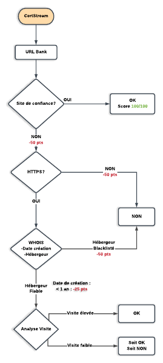

# Rapport de conception [v2]

BOUGAUD Yves - M2 Cyber  
KHOUBI Sina - M2 Cyber  
LEBRETON Mickaël - M2 Cyber  

07 Décembre 2019

## Introduction

Le but de ce TP est de développer un outil de détection, afin de détecter automatiquement des sites web utilisés dans le cadre de campagne d’hameçonnages ciblées. Nous utiliserons ici le langage Python. Nous nous restreindrons ici aux sites bancaires. Les sites auront au départ 100 points, qui diminuerons en fonction de nos vérifications sur l’URL.

## Processus de détection

Nous avons choisi certains critères que nous avions lister au début du TP, qui sont les suivants :

* Variation d’URL
* vérification du certificat HTTPS
* Analyse des données de WHO.IS (date de réservation du nom de domaine, serveur de nom)
* Analyse de la fréquence de visite du site

Le CertStream nous renvoie plusieurs URL. Dans URL Bank, nous trions ces URL avec des mots clés tels que « banque », « bank », ou encore « credit ». Une fois ces URL filtrées, si certaines contiennent des mots clés, elles sont envoyées à notre fonction de vérification de site de confiance.

En nous basant sur un fichier répertoriant presque tous les sites de banques, si l’URL appartient à cette liste, notre programme renvoie « OK », ce qui veut dire que le site n’est pas dangereux.

Dans le cas contraire, 50 points sont directement enlevés. Nous renvoyons ensuite l’URL vers une autre fonction, qui vérifie si le certificat HTTPS est valide. Si ce n’est pas le cas, 50 points sont encore retirés, pour arriver à 0. Le programme renvoie alors une alerte, car l’URL n'est pas dans les sites de confiance et n’a pas l’HTTPS d’activé, donc il est très probable que ce soit un site dangereux.

Si le certificat HTTPS est valide, l’URL fait l’objet d’une analyse avec l’outil WHO.IS, afin d’obtenir plusieurs informations, telles que le serveur de nom de domaine ou encore la date de création du site.

Si le site est trop récent nous enlevons 25 points.
Enfin, nous effectuons une dernière analyse sur l’URL, afin d’obtenir des statistiques sur les visites. Ceci nous permet de savoir si c’est un site fréquenté ou non, et si c’est un site potentiellement dangereux ou non.

Nous envoyons ensuite le résultat avec le score. Les sites ainsi analysés sont sauvegardé dans un fichier de log nommé "IDS.txt" au format STIX.

Par ailleurs si, à la fin, un site dispose de 50 points il est stocké dans un second fichier en vue d'être ajouté à la site de confiance. En effet, un score de 50 points indique qu'un site a passé tous les tests avec succès mais qu'il n'était tout simplement pas listé dans la liste des sites de confiance.

   

## Exemple de sortie au format STIX2
~~~~
{
    "type": "indicator",
    "pattern": "[url:value = 'www.onlyforbanking.com']",
    "description": "Score = 0 | Pas de donnee Alexa.",
    "labels": [
        "malicious-activity"
    ],
    "valid_from": "2018-12-07T20:38:27.967381Z",
    "name": "URL Suspecte",
    "id": "indicator--6711367c-b40f-452e-b4a3-ec20361789d8",
    "modified": "2018-12-07T20:38:27.967Z",
    "created": "2018-12-07T21:38:27.967Z"
}
~~~~

## Code source
https://github.com/AsPhiXie/IDS

Dépendances pip :
~~~~
python-whois
stix2
certstream
~~~~

Pour exécuter le programme :
~~~~
python3 cti_main.py
~~~~
